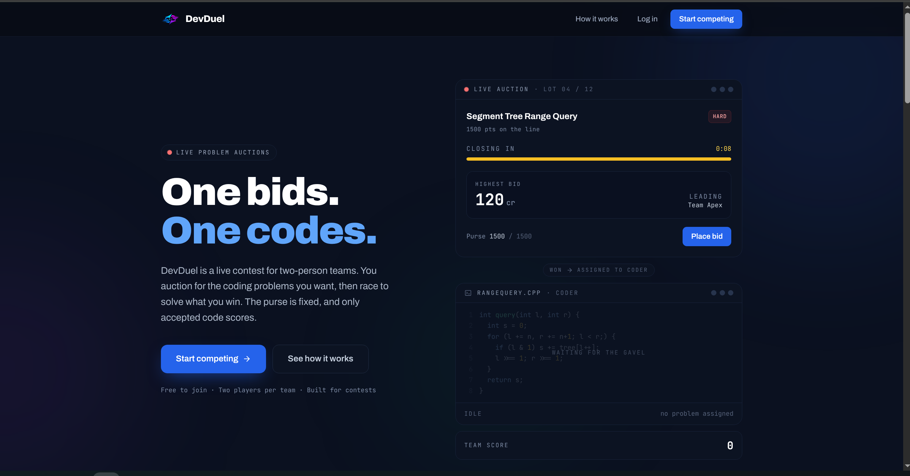
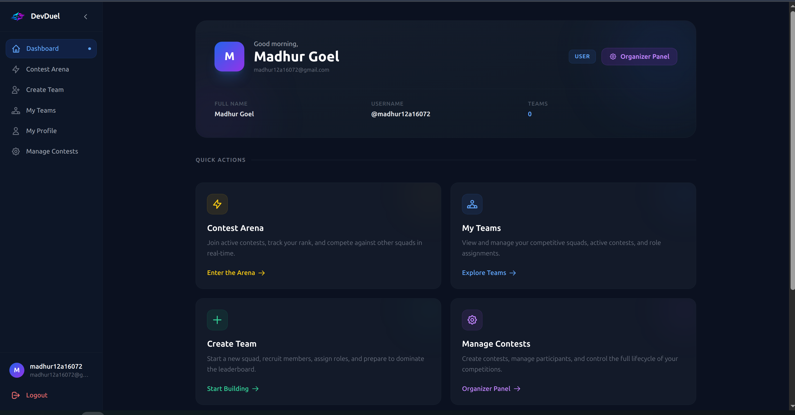
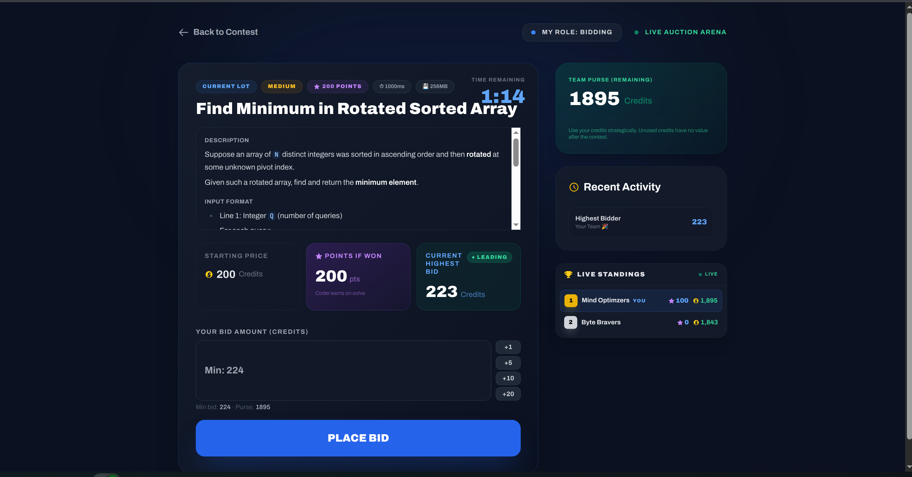
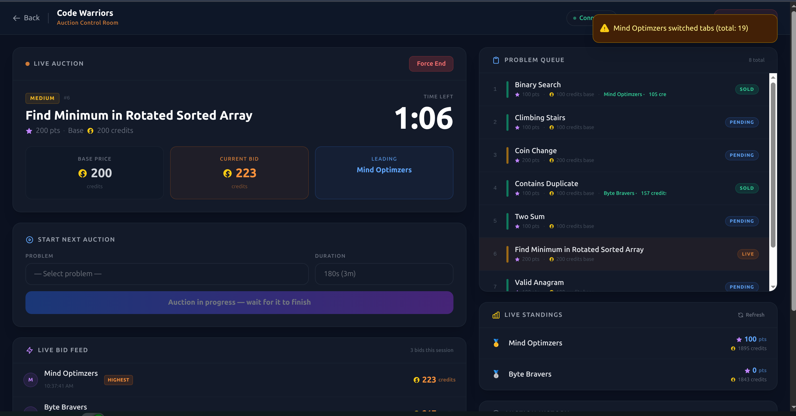
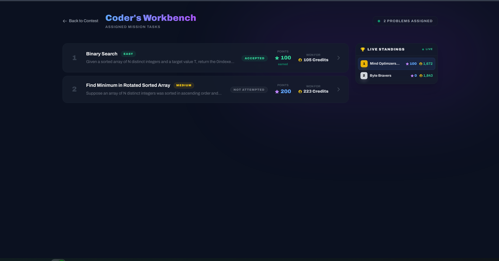
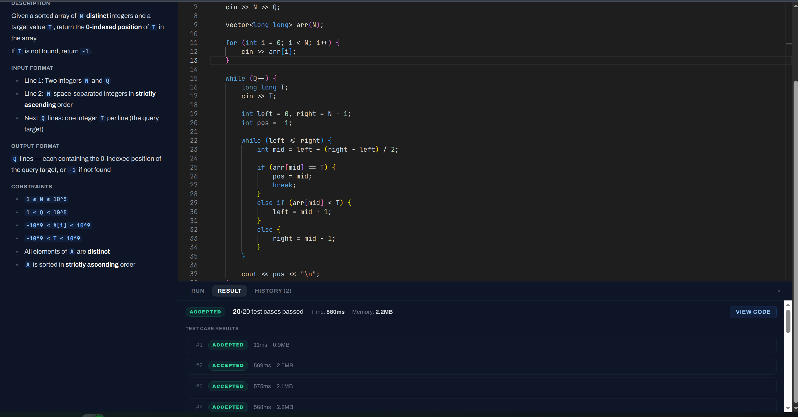
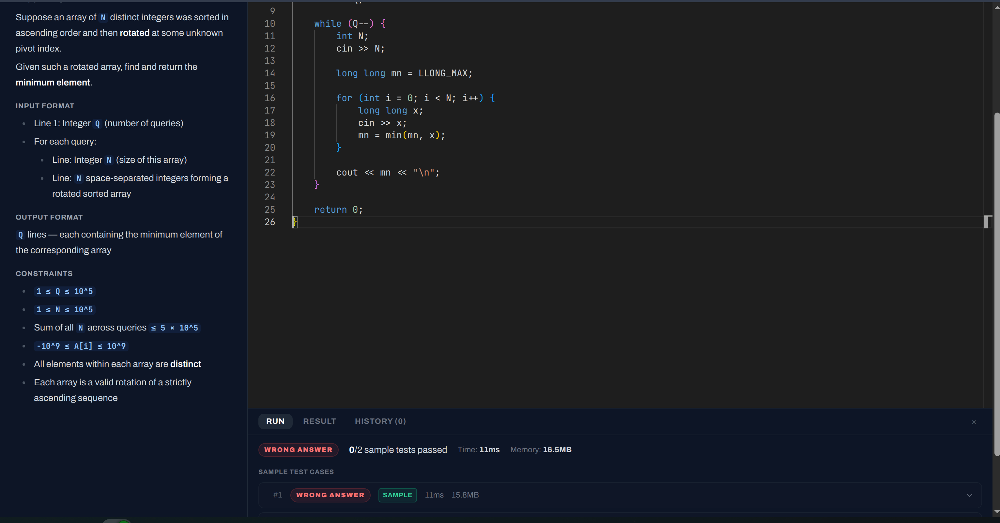
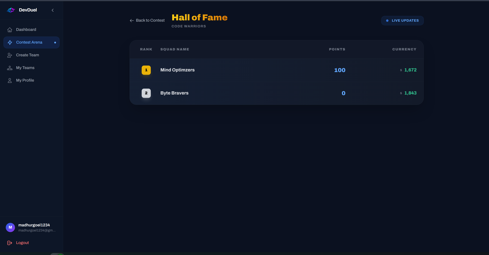
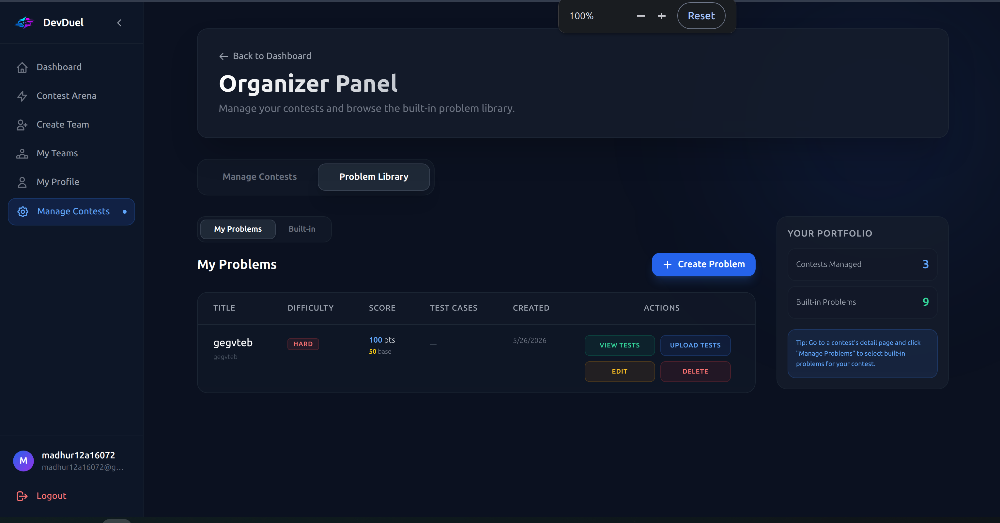
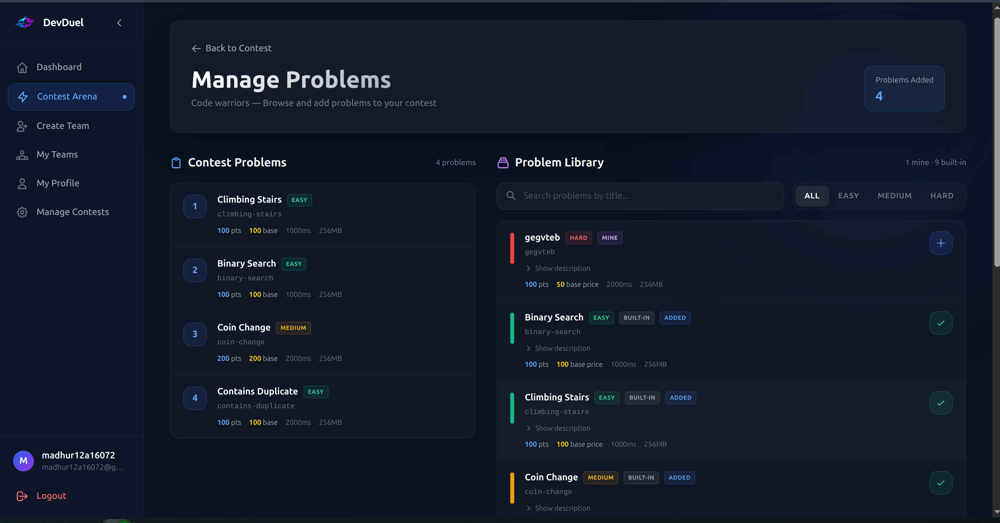

# DevDuel

**A competitive programming platform where teams race against each other — bidding on problems and solving them under pressure.**

Live at [devduel.site](https://devduel.site)

<p align="center">
  
</p>

---

## What is DevDuel?

DevDuel is a real-time competitive programming platform built around a unique twist on team contests. Each team of two has a fixed budget and a set of programming problems available for auction. Before any code gets written, teams bid against each other to acquire problems. Once bidding closes, coders hit the editor and race to submit correct solutions. The team with the highest score wins.

**The twist:** Roles are locked. One teammate is the **Bidder** (manages the auction), the other is the **Coder** (writes the solutions). Communication and trust between both matter.

---

## Features

- **Team formation** — Create or join teams; invite teammates via email link
- **Contest lifecycle** — `DRAFT → REGISTRATION_OPEN → ACTIVE → ENDED`
- **Real-time auction** — WebSocket-powered bidding room; server-side rate limiting per user
- **Dual roles** — Bidder and Coder roles assigned per team per contest; locked once set
- **Code execution** — Submit solutions against hidden test cases via Judge0; synchronous judging with no client-side polling
- **Problem management** — Built-in and custom problems; test cases stored on Google Cloud Storage
- **Custom problem probing** — Organizers can probe custom problems against sample solutions before publishing
- **Auth** — Email/password with OTP verification + Google OAuth; JWT access/refresh tokens with Redis blacklisting
- **Rate limiting** — Per-IP limits on auth endpoints; per-user burst and sustained limits on code submissions
- **Organizer tools** — Create contests, manage problems, and monitor submissions

---

## Screenshots

### Your dashboard

The home base — jump into a contest, spin up a team, or open organizer tools.

<p align="center">
  
</p>

### The auction

Bidders compete for problems in real time. Organizers run the room from a live control panel.

<p align="center">
  
  <br><em>Bidder — Live Auction Arena</em>
</p>

<p align="center">
  
  <br><em>Organizer — Auction Control Room</em>
</p>

### Coding & judging

Coders work through the problems their team won, then submit against hidden test cases — judged synchronously, no client-side polling.

<p align="center">
  
  <br><em>Coder's Workbench — assigned problems</em>
</p>

<table>
<tr>
<td width="50%" align="center"><br><em>Accepted — 20/20 test cases passed</em></td>
<td width="50%" align="center"><br><em>Wrong Answer — sample tests failed</em></td>
</tr>
</table>

### Results

<p align="center">
  
  <br><em>Hall of Fame — live standings by points and currency</em>
</p>

### Organizer tools

Browse the built-in problem library, author custom problems, and curate the problem set for each contest.

<p align="center">
  
  <br><em>Organizer Panel — your problems and contest portfolio</em>
</p>

<p align="center">
  
  <br><em>Manage Problems — add problems to a contest from the library</em>
</p>

---

## Tech Stack

| Layer | Technology |
|---|---|
| API Framework | FastAPI (Python 3.11+) |
| Database | PostgreSQL + SQLAlchemy 2.0 (async, via asyncpg) |
| Migrations | Alembic |
| Cache / Pub-Sub | Redis |
| Real-time | WebSocket (auction bidding) |
| Code Execution | Judge0 API |
| Test Case Storage | Google Cloud Storage |
| Auth | JWT (HS256) + Google OAuth 2.0 |
| Email | SMTP (Gmail) |
| Task Queue | ARQ (async Redis queue) |
| Deployment | GCP VM Instance |

---

## Architecture

The backend is a Python/FastAPI application following a strict 4-layer pattern per module:

```
routes → handlers → services → dao
```

- **routes/** — FastAPI router + endpoint declarations
- **handlers/** — Request validation, dependency injection, response formatting
- **services/** — Business logic and orchestration
- **dao/** — Data access (SQLAlchemy async ORM)

```
app/
├── api/
│   ├── auth/          # Registration, login, OTP, OAuth, password reset
│   ├── users/         # User profile management
│   ├── teams/         # Team creation, invites, membership
│   ├── contests/      # Contest CRUD, registration, lifecycle
│   ├── problems/      # Problem management, test cases
│   ├── bidding/       # Auction engine, WebSocket, bid history
│   ├── submissions/   # Code submission and judging
│   └── common/        # Shared dependencies, pagination, response envelopes
├── core/
│   ├── config.py      # Settings via pydantic-settings (.env)
│   ├── database.py    # Async SQLAlchemy engine + session
│   ├── redis.py       # Redis client singleton
│   ├── security/      # JWT creation/validation, bcrypt hashing
│   ├── exceptions/    # Domain exception hierarchy
│   └── middleware/    # Request ID + request logging
├── database/
│   └── models/        # SQLAlchemy models (users, teams, contests, problems, bidding, submissions)
└── services/
    ├── judge0/        # Code execution client (batch, polling)
    ├── storage/       # GCS test case upload/download
    └── email/         # SMTP email (OTP, invitations, password resets)
```

All I/O is async (database, Redis, HTTP clients). Dependencies are injected via FastAPI `Depends()`.

